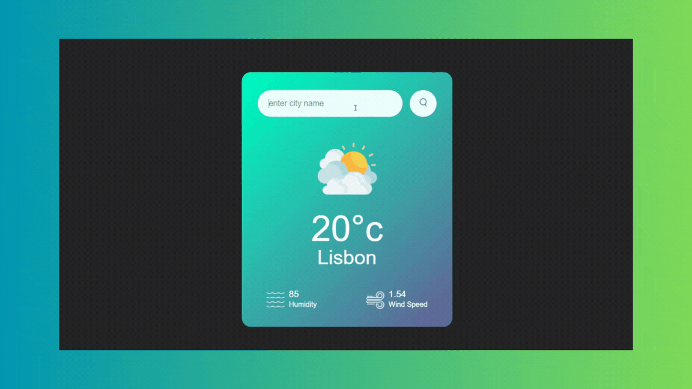

# WeatherApp

<h1>Project Introduction:</h1>

<h4>🔍 Project: Weather Tracking Application 🌤️

In this project, I developed a user-friendly application that allows users to quickly and easily track current weather conditions.</h4>

<h1>API Integration:</h1>

<h4>Weather data is dynamically fetched using the "OpenWeather" API.</h4>

<h1>Front End Technologies:</h1>

 <h4>The front-end was built using HTML and CSS, and made dynamic with JavaScript.</h4>

<h1>Responsive Design:</h1>

<h4>The interface is compatible across devices (mobile and desktop).</h4>

<h1>User Experience:</h1>

<h4>With a simple and functional structure, users can instantly access the weather information they need.</h4>

<h1>Target</h1>

<h4>Through this project, I gained valuable experience in API integration and dynamic data handling, while adopting a user-centric design approach. 🌟</h4>

# "Preview of the working project"

